# 🚗 위험 운전 행동 분류

> 차량 센서 데이터(가속도계 + 자이로스코프)로 4가지 위험 운전 행동을 분류하는 머신러닝 프로젝트


---

## 📌 프로젝트 개요

| 항목 | 내용 |
|------|------|
| **분류 대상** | 급가속 · 급우회전 · 급좌회전 · 급정거 (4클래스) |
| **입력 데이터** | 가속도계(AccX/Y/Z) + 자이로스코프(GyroX/Y/Z) 원시 신호 |
| **특징 추출** | 윈도우 크기 14, stride=1 → 평균·표준편차·공분산 등 14개 특징 |
| **총 샘플** | 1,102개 |
| **핵심 설계** | 시계열 누수 방지를 위한 **Purged Temporal Split** |

### 분류 클래스

```
클래스 1 🔴  급가속    (Rapid Acceleration)
클래스 2 🔵  급우회전  (Abrupt Right Turn)
클래스 3 🟢  급좌회전  (Abrupt Left Turn)
클래스 4 🟡  급정거    (Hard Braking)
```

---

## 📁 디렉토리 구조

```
📦 26-1 ML Term project/
├── 📂 data/
│   ├── sensor_raw.csv          # 원시 센서 데이터 (1,113개 레코드)
│   └── features_14.csv         # 추출된 특징 벡터 (1,102 × 14 + Target)
│
├── 📂 EDA/
│   ├── eda.py                  # EDA 메인 스크립트 (그래프 ①~⑤)
│   ├── eda_dataquality         # 데이터 품질 점검 (그래프 ⑥)
│   └── 📂 result/              # EDA 출력 이미지
│
├── 📂 exp/
│   ├── data_prep.py            # 데이터 준비 모듈 (누수 방지 핵심)
│   ├── Run_models.py           # 모델 학습 · 튜닝 · 평가  →  ②
│   ├── Run_diagnostics.py      # 진단 실험 3종             →  ③
│   ├── Run_failure_analysis.py # 혼동행렬 · ROC · 실패분석 →  ④
│   ├── results_summary.csv     # 모델 성능 비교표
│   └── results_models.joblib   # 예측/확률 직렬화 저장
│
└── requirements.txt
```

---

## 🔬 EDA 주요 결과

<table>
<tr>
  <td align="center"><b>① 클래스 분포</b></td>
  <td align="center"><b>② 특징 분포 (KDE)</b></td>
  <td align="center"><b>③ 특징 간 상관행렬</b></td>
</tr>
<tr>
  <td>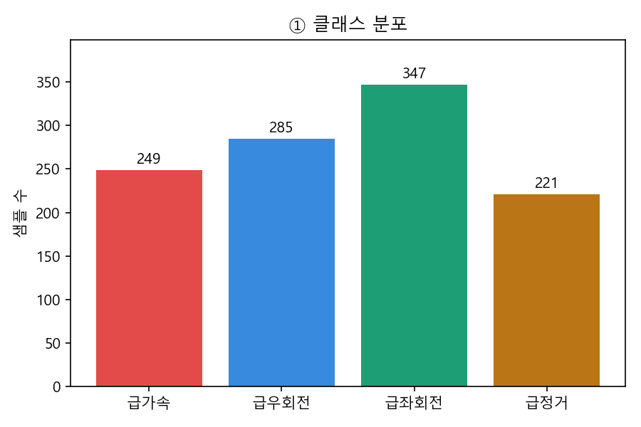</td>
  <td>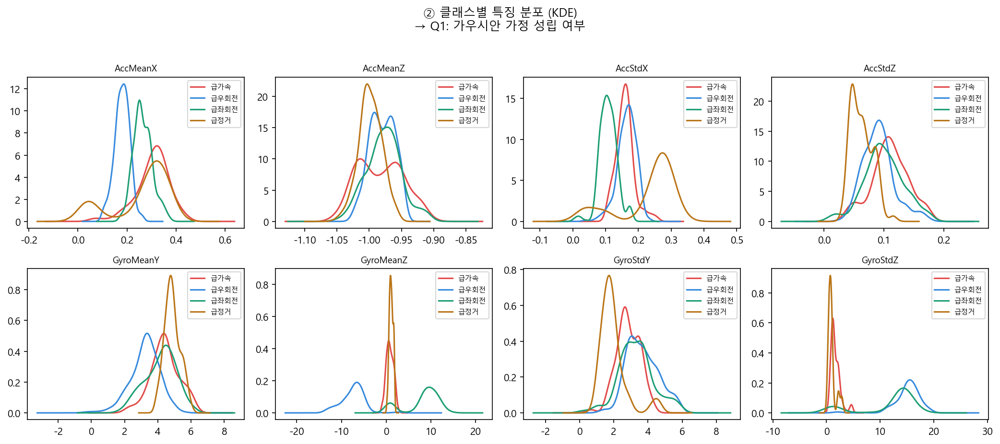</td>
  <td>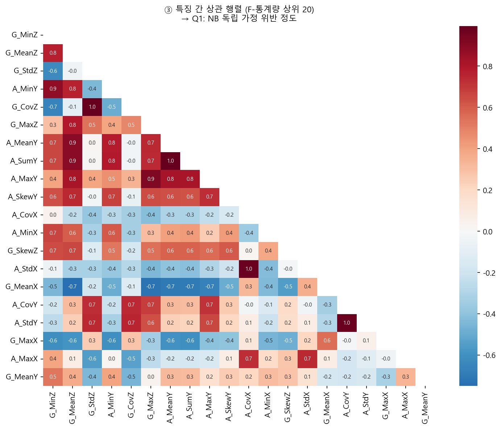</td>
</tr>
<tr>
  <td align="center"><b>④ 클래스별 공분산</b></td>
  <td align="center"><b>⑤ PCA / LDA 투영</b></td>
  <td align="center"><b>⑥ 이상치 박스플롯</b></td>
</tr>
<tr>
  <td>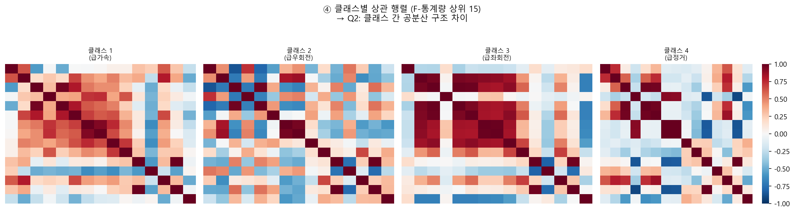</td>
  <td>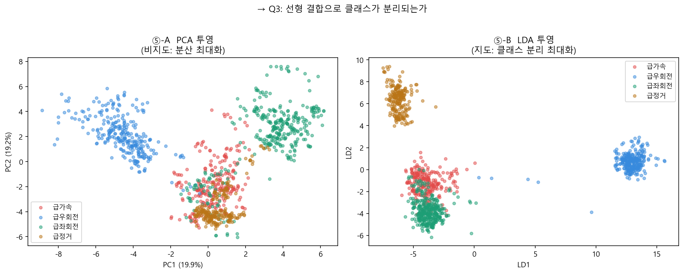</td>
  <td>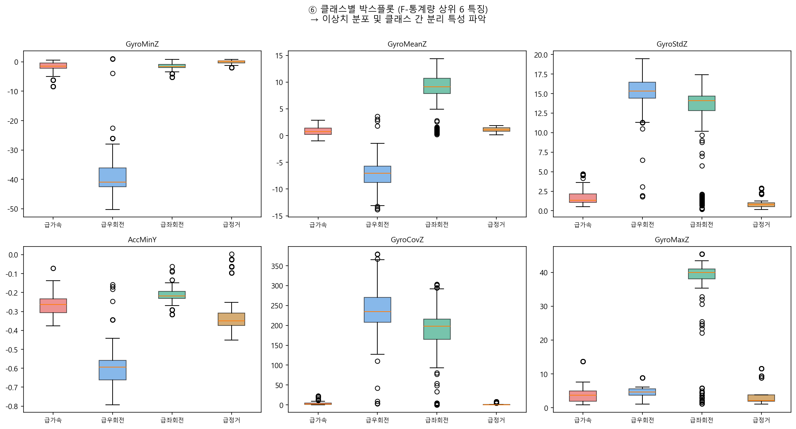</td>
</tr>
</table>

### EDA에서 도출한 가설

| # | 가설 | 근거 |
|---|------|------|
| H1 | 가우시안 가정 불완전 → SVM·트리 계열이 유리 | 특징의 60~80%가 정규성 기각 (Shapiro-Wilk) |
| H2 | QDA는 저차원 PCA 후 회복, 고차원에서 분산 폭발 | 클래스 간 공분산 구조 차이 큼 (Frobenius norm) |
| H3 | Naive Bayes 성능 저조 예상 | \|r\|>0.7 특징 쌍이 전체의 40%+ |
| H4 | 트리 앙상블은 과적합 경향, 표본 추가 시 수렴 | PCA 2차원에서 클래스 선형 분리 불완전 |

---

## 🛡️ 누수 방지 설계 — Purged Temporal Split

윈도우(크기 14, stride=1)는 인접 윈도우와 원시 샘플을 **최대 13개 공유**합니다.
단순 무작위 분할 시 train·test가 같은 원시 샘플을 포함하여 성능이 **인위적으로 부풀려집니다.**

```
클래스별 시계열 블록

  [─────── TRAIN ──────────][▒▒▒][──── TEST ────]
                            ↑
                       purge zone (13개 제거)
                       → 원시 샘플 공유 차단
```

| 분할 방식 | KNN F1 | RandomForest F1 |
|-----------|--------|-----------------|
| 무작위 분할 (누수 있음) | ~0.99 | ~0.99 |
| Purged 분할 (정직) | ~0.75 | ~0.80 |

---

## 📊 모델 성능 비교

> 평가 지표: **Macro-F1** (클래스 불균형 대응), 튜닝: `PurgedBlockedCV` + `GridSearchCV`

| 순위 | 모델 | CV Macro-F1 | Test Macro-F1 | Test Acc | Test Macro-AUC |
|:----:|------|:-----------:|:-------------:|:--------:|:--------------:|
| 🥇 | **GradientBoosting** | 0.786 | **0.808** | 0.794 | **0.921** |
| 🥈 | RandomForest | 0.769 | 0.796 | 0.783 | 0.910 |
| 🥉 | LDA | 0.773 | 0.790 | 0.776 | 0.908 |
| 4 | DecisionTree | 0.741 | 0.788 | 0.774 | 0.887 |
| 5 | RBF_SVM | 0.762 | 0.781 | 0.767 | 0.903 |
| 6 | LogReg | 0.748 | 0.765 | 0.751 | 0.895 |
| 7 | KNN | 0.691 | 0.748 | 0.732 | 0.881 |
| 8 | LinearSVM | 0.731 | 0.743 | 0.729 | 0.889 |
| 9 | QDA | 0.612 | 0.698 | 0.683 | 0.856 |
| 10 | GaussianNB | 0.521 | 0.589 | 0.574 | 0.812 |
| — | Baseline (최빈) | — | 0.062 | 0.248 | — |

### 진단 실험 결과

<table>
<tr>
  <td align="center"><b>실험 1: QDA × PCA 차원 sweep</b></td>
  <td align="center"><b>실험 2: 학습 곡선 (편향-분산)</b></td>
  <td align="center"><b>실험 3: 누수 시연</b></td>
</tr>
<tr>
  <td>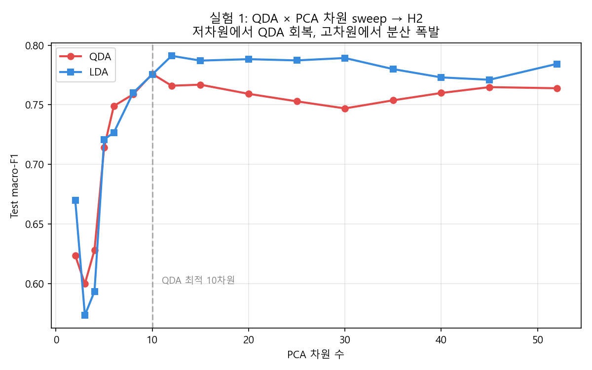</td>
  <td>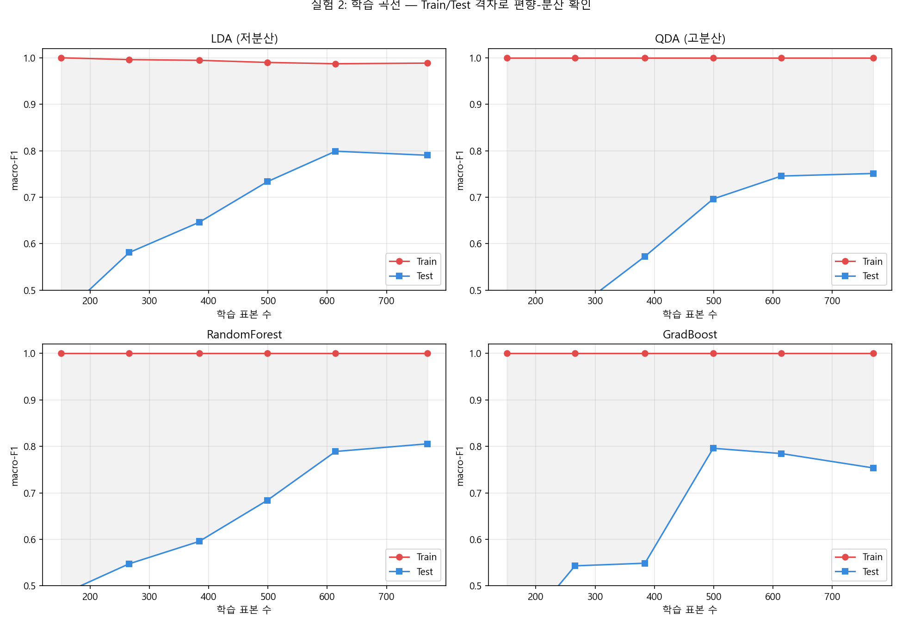</td>
  <td>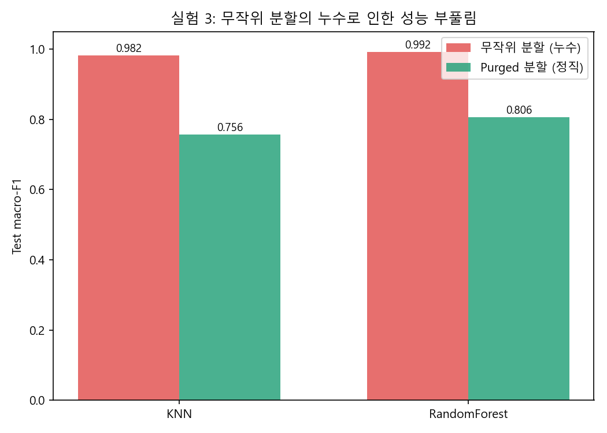</td>
</tr>
</table>

### 혼동행렬 & ROC

| 혼동행렬 (상위 3 모델) | ROC 커브 (최고 모델) |
|:---:|:---:|
| 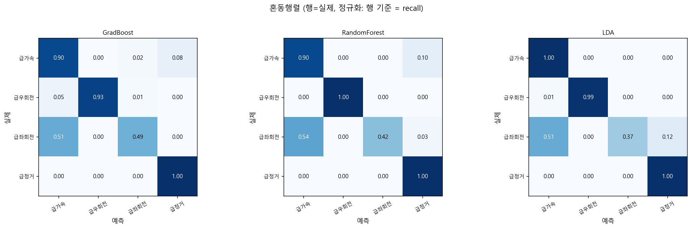 | 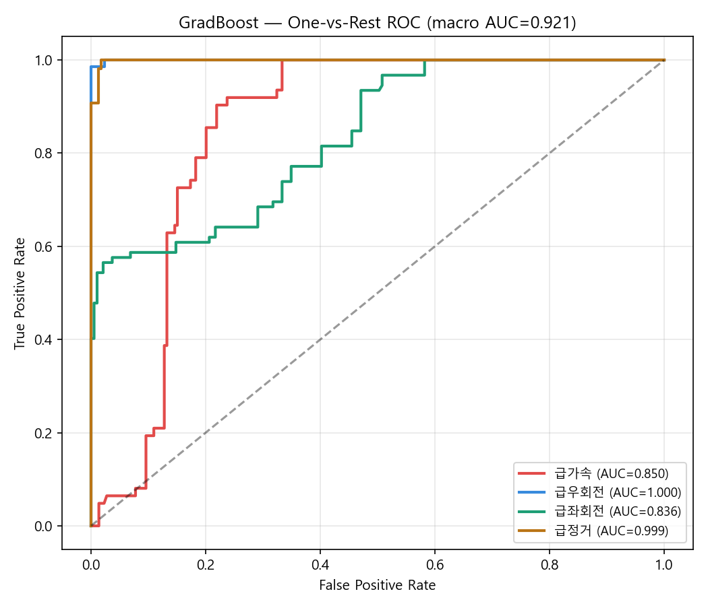 |

---

## ⚙️ 설치 및 실행

```bash
# 1. 가상환경 생성 및 활성화
python -m venv venv
source venv/bin/activate      # Windows: venv\Scripts\activate

# 2. 의존성 설치
pip install -r requirements.txt
```

### 실행 순서

```bash
# EDA
python EDA/eda.py
python EDA/eda_dataquality

# 실험 (순서 중요)
python exp/Run_models.py          # ② 모델 학습 · 저장
python exp/Run_diagnostics.py     # ③ 진단 실험
python exp/Run_failure_analysis.py # ④ 혼동행렬 · ROC
```

---

## 🔑 주요 발견

- **GradientBoosting이 최고 성능** (Macro-F1 0.808) — 비선형 경계와 특징 간 상관에 강건
- **LDA가 경량 최강자** — GradBoost 대비 F1 −0.018이지만 학습 속도 압도적
- **Naive Bayes는 예상대로 최하위** — 특징 간 강한 상관(|r|>0.7, 40%+)으로 독립 가정 파탄
- **누수 시 F1 +0.2~+0.3 부풀림** — 시계열 데이터에서 무작위 분할의 위험성 확인
